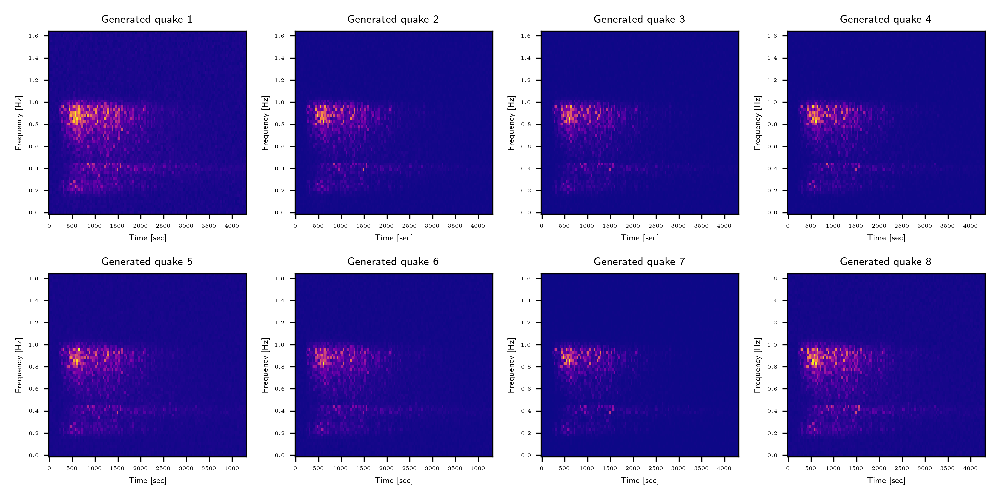
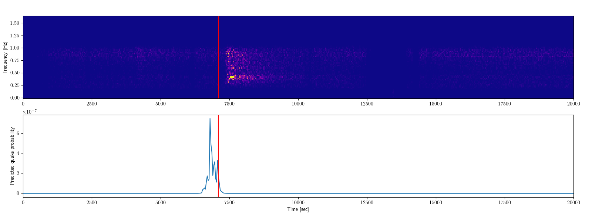
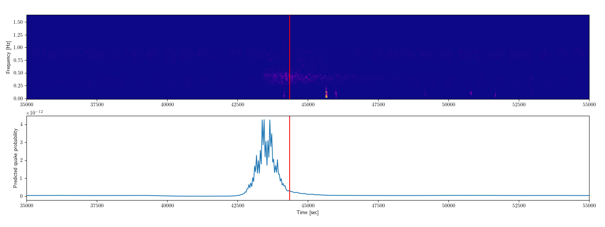
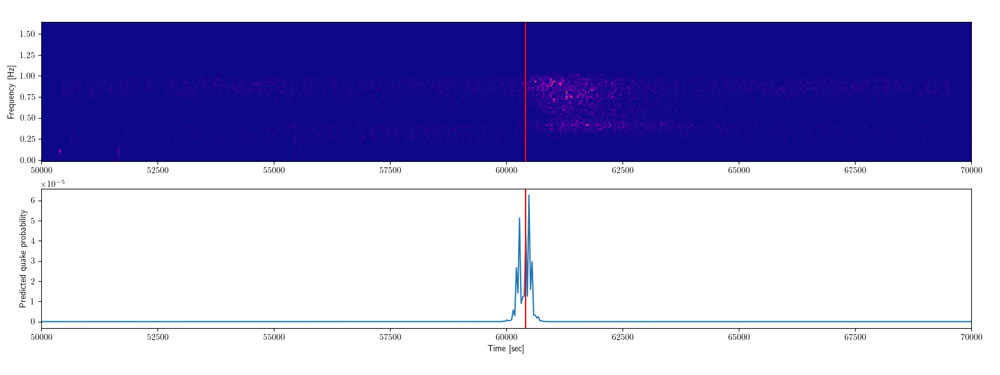

<p align="center">
  
</p>

# Variational Autoencoders for Data Augmentation in Lunar Seismic Frequency Domain Analysis Using Convolutional Neural Networks

<hr>

[](icons)

## Authors

A passionate team of college students from Montréal, Canada, who use their computers as makeshift room heaters to stay warm through the harsh Canadian winters. We're curious about the future of machine learning, and want to learn about this now ubiquitous tool.

Tian Yi Xia<sup>1</sup>, Thomas Deleuze-Bisson<sup>1</sup>, Mateo Duque<sup>1</sup></h4>

<sup>1</sup>Dawson College, Montréal


## The Challenge: Seismic Detection Across the Solar System

NASA Space Apps 2024:

> Planetary seismology missions struggle with the power requirements necessary to send continuous seismic data back to Earth. But only a fraction of this data is scientifically useful! Instead of sending back all the data collected, what if we could program a lander to distinguish signals from noise, and send back only the data we care about? Your challenge is to write a computer program to analyze real data from the Apollo missions and the Mars InSight Lander to identify seismic quakes within the noise!

## Our Solution: VAEs and CNNs

We propose **QuakeVAE**, a variational autoencoder as a dataset augmentation technique for frequency-domain lunar seismic data.

<p align="center">
  
</p>
<p align="center">
  
</p>

We also propose **QuakeCNN**, a convolutional neural network, to classify over time absence and presence of seimic events.

<p align="center">
  
</p>

## Project Structure

We build a sequential development pipeline:

- `model/`: Implementations of VAE and CNN in PyTorch, and data manipulation.

  - `a_generate_spectrogram.py`: Convert lunar and martian seismic timeseries into the frequency domain with discrete fourier transform.
  - `b_verify_spectrogram.py`: Visualize frequency domain spectrograms.
  - `c_generate_catalog.py`: Load known seismic frequency domain data into a list for training the VAE in generating more.
  - `d_vae_train.py`: **Variable autoencoder** to learn lunar seismic patterns by training on known seismic frequency domain data.
  - `e_vae_infer.py`: Randomly sample autoencoder latent space for **generating statistically faithful lunar seismic frequency domain data**.
  - `f_cnn_train.py`: **Convolutional neural network** with sliding window to classify lunar seismic frequency domain data into earthquake and non-earthquake events.
  - `g_cnn_infer.py`: Verify success of CNN in classification.
  - `h_cnn_apply.py`: Apply CNN over all lunar seismic frequency domain (both training and testing).
  - `i_verify_apply.py`: Generate catalog of seismic events by analyzing softmax probability.

- `data/`: Directory containing extracted NASA Space Apps data.

- `dataset/`: Generated .pth, .npz files.

## Getting Started

Before running the code, ensure the following packages are installed. Note that we use PyTorch with CUDA 11.8 on NVIDIA RTX 2080 to accelerate training, although cpu compute will also work.

- python>=3.10
- matplotlib==3.8.4
- numpy==2.1.2
- optuna==4.0.0
- pandas==2.2.3
- scipy==1.14.1
- torch==2.2.2
- tqdm==4.66.2

### Prerequisites

Please install dependencies either manually, or using requirements.txt.

```bash
pip install -r requirements.txt
```

Extract the [Space Apps 2024 Seismic Detection Data Packet](https://www.spaceappschallenge.org/nasa-space-apps-2024/challenges/seismic-detection-across-the-solar-system/?tab=resources) into a `data/` folder, ensuring `data/data/lunar/*` and `data/data/lunar/*` are accessible. Create a `dataset/` folder for intermediate program outputs.

```bash
mkdir data/data
mkdir dataset/data
```

### Running the Scripts

1. Run discrete fourier transform (DFT) over lunar and martian time series. You can modify the window size for the time-to-frequency domain transformation. The technical details of parsing the given `.csv` data from NASA Space Apps is abstracted here.

```bash
python model/a_generate_spectrogram.py
python model/b_verify_spectrogram.py
```

2. Generate known lunar seismic frequency domain data for training the variational autoencoder (VAE). We move the catalogs of existing earthquakes from `data/` to `dataset/`, and we drop `evid00029` - because its time was not synchronized.

```bash
python model/c_generate_catalog.py
```

3. Train the VAE (QuakeVAE) and sample its latent space to generate more frequency-domain seismic data. We use **128 latent dimensions**. You can change the rest of the hyperparameters that compose the linear encoder-decoder structure to adjust intrinsic generated data properties. Each seismic frequency-domain data is fed in **2D snapshots (64x128)** of 0.0Hz to 1.5Hz (64 frequency bins) over ~1 hour 10 minutes (128 time steps of ~33 seconds each). We use a standard stochastic gradient descent (SGD) as optimizer, and a binary cross-entropy loss summed with KL-divergence (beta=100) as a loss function to encourage accurate data reconstruction.

```bash
python model/d_vae_train.py
python model/e_vae_infer.py
```

4. Train the CNN (QuakeCNN) built from the AlexNet structure and test using real data. The learning rate, batch size and number of epochs is determined using **bayesian optimization**. You can try changing the hyperparameter space bounds to achieve a better accuracy, and the model definition. We use three `Conv2d` layers followed by `MaxPool2d` and `ReLU` activation. Cross entropy loss function is used for classfication of presence and absence of quake. We use Adam optimizer due to time constraints as SGD had too slow convergence rate.

```bash
python model/f_cnn_train.py
python model/g_cnn_infer.py
```

5. The totality of lunar seismic frequency domain data is transformed into `64x128` snapshots by **sliding window**. We apply QuakeCNN over each window and save the classification tensor. Depending on normalization techniques, the sensitivity of the model can be adjusted by remapping the frequency-domain seismic data into a range different than `[0, 1]`. A catalog of detected lunar seismic events is generated, and we visualize spectrogram against probability of quake as a function of time. We use threshold of $p_{quake} > 1e-13`$ given by QuakeCNN's softmax classfication output to determine the presence or absence of a quake. Modify to adjust model sensitifiy and false-positive rate.

```bash
python model/h_cnn_apply.py
python model/i_verify_apply.py
```

### Results

Generated frequency-domain lunar seismic data using QuakeVAE using uniform random latent space (dim=128) sampling and decoder.

<p align="center">
  
</p>

Predictions of absence and presence of lunar quake event with QuakeCNN: **test accuracy 88%**.

<p align="center">
  
</p>

Detected lunar seismic event examples with QuakeCNN.

<p align="center">
  
</p>

<p align="center">
  
</p>

<p align="center">
  
</p>

Our [predicted catalog of seismic events](./model/i_verify_apply_lunar_catalog.csv) is located at `model/i_verify_apply_lunar_catalog.csv`

### Limitations

Due to time constraints, we could not apply the CNN for martian data and bandwidth for training, although the branch of code necessary for it is already implemented.

### Links

- [Team Quake Matrix](https://www.spaceappschallenge.org/nasa-space-apps-2024/find-a-team/git-commit-push/) of NASA Space Apps 2024.
- [Project Website](https://thataquarel.github.io/quake_matrix/).
- [Challenge Description](https://www.spaceappschallenge.org/nasa-space-apps-2024/challenges/seismic-detection-across-the-solar-system/?tab=resources).

### Datasets

- [NASA CGI Moon Kit](https://svs.gsfc.nasa.gov/4720/)
- [Space Apps 2024 Seismic Detection Data Packet](https://www.spaceappschallenge.org/nasa-space-apps-2024/challenges/seismic-detection-across-the-solar-system/?tab=resources)

### Contacts

- [Tian Yi, Xia](https://github.com/ThatAquarel/space), xtxiatianyi@gmail.com: Machine learning models programmer (QuakeVAE and QuakeCNN), and data wrangling.
- [Thomas, Deleuze-Bisson](https://github.com/Thomas4534), mateoduque31@hotmail.com: QuakeCNN structure and website building.
- [Mateo, Duque](https://github.com/MatTheGreat1/): Documentation, video-presentation and soft-skills.

### References

- Kingma, D. P., & Welling, M. (2022, December 10). Auto-Encoding Variational Bayes. *arXiv*. https://arxiv.org/abs/1312.6114
 
- Indolia, S., Goswami, A. K., Mishra, S. P., & Asopa, P. (2018). Conceptual understanding of convolutional neural network: A deep learning approach. In *International Conference on Computational Intelligence and Data Science (ICCIDS 2018)* (pp. 1321-1327). Elsevier. https://doi.org/10.1016/j.procs.2018.04.196
 
- Yamashita, R., Nishio, M., Do, R.K.G. et al. Convolutional neural networks: an overview and application in radiology. Insights Imaging 9, 611–629 (2018). https://doi.org/10.1007/s13244-018-0639-9

- Zhou, H. W. (2014). Practical seismic data analysis. Cambridge University Press.
 
- Luo, H., Men, Y., & Zheng, Q. Sparse Autoencoders with KL Divergence.
 
- Li, Wenrui & Nakshatra, Fnu & Narvekar, Nitisha & Raut, Nitisha & Gao, Jerry. (2018). Seismic Data Classification Using Machine Learning. 10.1109/BigDataService.2018.00017.
 
- Wu, J. (2017, May 1). *Introduction to convolutional neural networks*. LAMDA Group, National Key Lab for Novel Software Technology, Nanjing University
 
- Haussler, D. (1999). Convolution kernels on discrete structures (Vol. 646). Technical report, Department of Computer Science, University of California at Santa Cruz.
 
- Wei, X.-L., Zhang, C.-X., Kim, S.-W., Jing, K.-L., Wang, Y.-J., Xu, S., & Xie, Z.-Z. (2022). Seismic fault detection using convolutional neural networks with focal loss. *Computers & Geosciences, 158*, Article 104968. https://doi.org/10.1016/j.cageo.2021.104968
 
- Chadebec, C., Allassonnière, S. (2021). Data Augmentation with Variational Autoencoders and Manifold Sampling. In: Engelhardt, S., et al. Deep Generative Models, and Data Augmentation, Labelling, and Imperfections. DGM4MICCAI DALI 2021 2021. Lecture Notes in Computer Science(), vol 13003. Springer, Cham. https://doi.org/10.1007/978-3-030-88210-5_17
 
- Wu, J., Chen, X. Y., Zhang, H., Xiong, L. D., Lei, H., & Deng, S. H. (2019). Hyperparameter optimization for machine learning models based on Bayesian optimization. Journal of Electronic Science and Technology, 17(1), 26-40.
 
- Wang, Y., Xu, C., You, S., Tao, D., & Xu, C. (2016). Cnnpack: Packing convolutional neural networks in the frequency domain. Advances in neural information processing systems, 29.
 
- Islam, Z., Abdel-Aty, M., Cai, Q., & Yuan, J. (2021). Crash data augmentation using variational autoencoder. Accident Analysis & Prevention, 151, 105950.
 
- Papadopoulos, D., & Karalis, V. D. (2023). Variational autoencoders for data augmentation in clinical studies. Applied Sciences, 13(15), 8793.
 
- Karapanagiotis, C., Wosniok, A., Hicke, K., & Krebber, K. (2021). Time-efficient convolutional neural network-assisted Brillouin optical frequency domain analysis. Sensors, 21(8), 2724.
